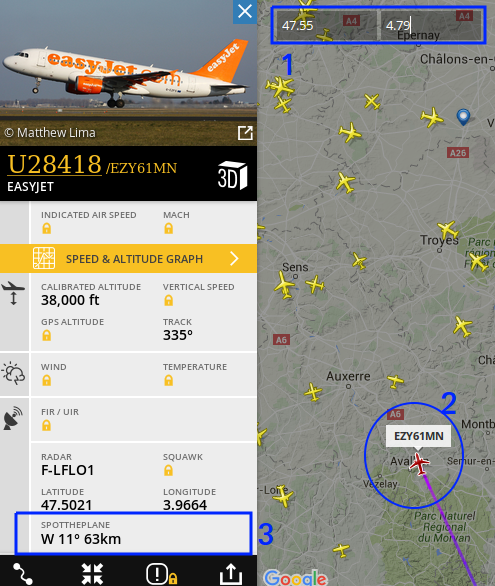

SpotThePlane
============

SpotThePlane is a user script for [flightradar24](http://flightradar24.com/) which make it easy to spot the actual plane you've selected in the sky. Just enter your coordinates, zoom to where you are and select a plane. On the left overlay containing information about the plane, a row is named *SpotThePlane* and contains the coordinates of the plane relative to *you*:

## Installation

 1. Install a user script manager for your browser. Here are the most popular:
 
   * For **Firefox**: [Greasemonkey](https://addons.mozilla.org/en-US/firefox/addon/greasemonkey/)
 
   * For **Chrome** and **Safari**: [Tampermonkey](https://tampermonkey.net/)
 
   * For **Opera**: [Violent Monkey](https://openuserjs.org/about/Violentmonkey-for-Opera)

 2. [Click Here](https://github.com/foobuzz/SpotThePlane/blob/master/SpotThePlane.user.js) to install the user script

## Configuration

Go to [flightradar24.com](http://flightradar24.com/) and click on a plane to open its information pannel on the left of the screen. The last row is named *SpotThePlane* and says *Awaiting coordinates*. At the right of the row, there is a pair of ellipsis separated by a pipe. Click on the left ellipsis to open an input in which you can enter your own latitude, then do the same with the right ellipsis with your longitude.

If the plane you've selected is out of sight, the row's value should become *Below the horizon*. Otherwise it shows the plane coordinates relative to the coordinates you've entered.

You can edit the coordinates you've entered by clicking on them again.

## Reading the plane coordinates

The plane coordinates are written in the following format: `<azimuth> <elevation>° <distance>km`

 - `<azimuth>` indicates where the plane is in reference to the cardinal directions. `N` means North, `WNW` means West-North-West and so on.

 - `<elevation>` indicates where the plane is on the vertical axis. The value is the angle in degrees relative to the horizon. The horizon is at 0° and the zenith is at 90°. A good rule of thumb is that when you hold your fist at arm's length, then your fist spans 10° on the sky.

 - `<distance>` is the distance between you and the plane, in kilometers. It's useful to know if you need to search for a tiny dot or for a relatively big shape.

Note: if the plane's altitude is too low to allow for condensation trails to form, then the string `No trails` is appended to the coordinates. However, there might be planes leaving no trails even if the string is not present.